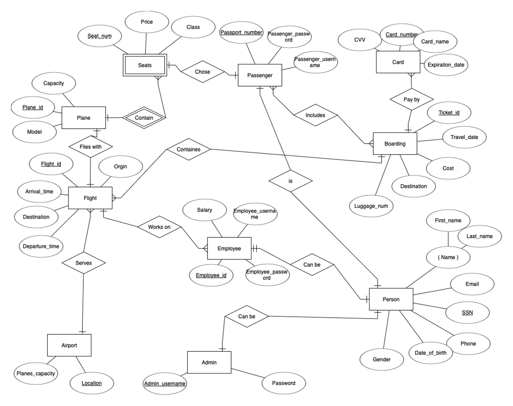

# Object Oriented Planes (OOP)

Object Oriented Planes (OOP) was originally a group project for a Java course. I'm excited to take this project further and reach new heights!

## Overview

OOP is a software program designed for flight booking.  It allows travelers to create accounts and provides an admin interface for common database requests and updates.

## Database

MySQL is used for the database.  The ER Diagram below illustrates the database structure:

## Compiling

Run the database sql file and the server
Compile the project and make sure the libaries(swing and mysql) are installed 
## Future Development

My plans for the future of this project include:

*   **Admin-Only Access:**  Restricting the software to admin use only.
*   **Web and Mobile Applications:** Transforming the system into a web-based application with accompanying mobile apps.
*   **Hybrid Database:**  Modifying the database to incorporate both structured and non-structured data (NoSQL).

## Motivation

I'm pursuing these enhancements simply because I'm passionate about the project and believe it will be a fantastic learning experience. I look forward to any help and collaboration!

## Notice

I have received permission from my group members to continue developing this project independently.